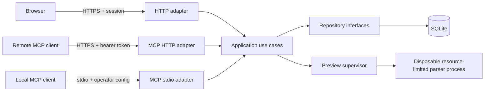

# Architecture

## Components

Application Tracker uses one TypeScript project with four explicit layers:

```text
src/
  client/       React interface and browser API client
  server/       HTTP, authentication, MCP, workers, and runtime entry points
  application/  Use cases, authorization, and transaction boundaries
  domain/       Schemas, entities, value objects, and domain errors
  infrastructure/
    database/   SQLite connection, migrations, bytes, and repositories
```

The domain and application layers do not import Express, React, SQLite, or the
MCP SDK. HTTP and MCP adapters translate external input into the same use cases.
Repositories implement interfaces owned by the application layer.

## Browser navigation

Authenticated workspace views have stable paths: `/dashboard`,
`/applications`, `/documents`, `/settings/lists`, `/settings/users`, and
`/settings/mcp`. The React client synchronizes those views with the browser
History API, so refresh and Back/Forward navigation preserve the active view.
The HTTP server returns the application shell for direct workspace links, but
the client resolves the session before rendering protected content. A member
who opens an administrator-only settings path is redirected to
`/settings/lists`.

## Runtime topology



## Database contract

SQLite runs with foreign keys enabled, WAL mode, a busy timeout, and owner-only
file permissions. All migrations are ordered, transactional where SQLite
allows, and recorded in `schema_migrations`. Tests create a database from zero
and migrate representative prior schemas forward.

The implementation and migration policy are described in
[`database.md`](database.md).
Online backup and restore procedures are described in
[`backup-restore.md`](backup-restore.md).

Local password verification and session lifecycle are described in
[`authentication.md`](authentication.md).
Administrator account creation, roles, and disablement are described in
[`user-management.md`](user-management.md).
The sanitized MCP status boundary and remote session registry are described in
[`mcp-status.md`](mcp-status.md).
The local stdio transport, explicit actor binding, and administrator-gated tools are
described in [`local-mcp.md`](local-mcp.md).
The closed-by-default remote transport and request controls are described in
[`remote-mcp.md`](remote-mcp.md).
The API error envelope, request correlation, and redacted JSON logging contract
are described in [`error-handling.md`](error-handling.md).
The application ledger is described in
[`application-ledger.md`](application-ledger.md).
Workspace-owned statuses, sources, role types, and document types are described
in [`reference-lists.md`](reference-lists.md).
Content-addressed original storage, upload limits, application associations,
and downloads are described in [`documents.md`](documents.md).

The schema separates:

- workspaces, users, credentials, memberships, sessions, and external identities
- applications, ordered contacts and links, audited deletion state, immutable
  creation or stage-transition events, and workspace reference values
- file objects, document metadata, application-document associations, and
  parser-versioned text or structured-email preview caches
- administrative settings and security audit events

Every query that returns workspace data accepts a workspace identifier. Dynamic
sort fields use code-owned allowlists; values always use bound parameters.

## Configuration contract

Runtime configuration is parsed once at startup through a typed schema. Invalid
or incomplete production configuration stops startup with a concise error.
`.env.example` contains safe examples, while `.env` and machine-specific MCP
configuration remain ignored.

Configuration is grouped into server, database, session, setup, OIDC, MCP,
document processing, and proxy settings. Secret values never appear in health
responses or logs.

## Delivery contract

Each commit must preserve a buildable repository and add the narrowest tests
that prove its behavior. Database, API, UI, MCP, and deployment slices land as
separate commits. Public releases come from signed tags after CI, migration,
backup/restore, accessibility, and security checks pass.
