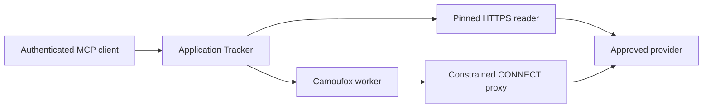

# Bounded Camoufox posting fallback

## Purpose and contract

The optional Camoufox fallback recovers structured `JobPosting` JSON-LD only
when the normal posting inspector has already:

1. recognized and canonicalized an exact provider posting URL;
2. applied the existing public-HTTPS, DNS, response-size, redirect, pacing,
   deduplication, and cooldown controls; and
3. returned `provider_challenge`.

Camoufox is an internal server-side implementation detail. It does not add an
HTTP or MCP browsing tool. `inspect_job_posting` keeps the existing input and
output schema, including its existing unavailable reasons. Digest processing
continues to report `inspectionSource: "provider_page"` because the worker is a
provider-page reader; privacy-safe structured logs record whether that read used
the fallback. `descriptionTruncated` and
`verification.mailboxReadOnly: true` remain unchanged.

The inspector and worker never create prospects, change applications, link
evidence, access a mailbox, or write mailbox state. After a successful provider
inspection, digest processing reruns the existing deterministic tracker matcher
with the canonical posting identity plus the inspected employer and title.
Posting-ID reuse or disagreement with the matched application's identity returns
`match.outcome: "conflict"`.

## Component boundaries



- The main app is the policy entry point. It validates the canonical provider
  identity and invokes the fallback only after `provider_challenge`
  (`src/application/job_posting_inspection.ts`).
- The app and worker share a dedicated internal control network. The worker has
  no network with an Internet gateway (`deploy/compose.yml`).
- Compose passes the worker only its browser policy, token, and resource
  settings. It does not inject the application's `.env`, database settings,
  Outlook credentials, MCP credentials, or session secrets into either
  sidecar.
- The worker accepts one authenticated internal request shape containing only a
  provider and exact canonical URL. It does not expose HTML, screenshots,
  cookies, storage, selectors, or page bodies (`camoufox-worker/worker.py`).
- The worker can reach only the egress proxy over a second internal network.
  The egress proxy alone joins an outbound network. It accepts only HTTP
  `CONNECT` to port 443, checks the hostname suffix allowlist, rejects every
  private or reserved DNS answer, and connects to one validated address
  (`camoufox-worker/egress_proxy.py`).
- Browser routing independently rejects non-HTTPS requests, redirect identity
  changes, unapproved hosts, service workers, downloads, WebRTC, images, fonts,
  and media.
- Camoufox's default uBlock Origin add-on is explicitly excluded so browser
  startup never performs a moving runtime download; all executable runtime
  artifacts come from the pinned image build. The launch also supplies the
  pinned browser major version (`152`) so Camoufox does not attempt moving
  browser discovery. Read-only local Camoufox install metadata points browser
  and font lookup at the verified `/opt/camoufox` bundle.

The focused threat model is in
[`camoufox-worker-threat-model.md`](camoufox-worker-threat-model.md).

## Pinned runtime

| Component                    | Pin                                                                                                                          |
| ---------------------------- | ---------------------------------------------------------------------------------------------------------------------------- |
| Worker and egress base image | `python:3.12.11-slim-bookworm` at OCI index digest `sha256:519591d6871b7bc437060736b9f7456b8731f1499a57e22e6c285135ae657bf7` |
| Camoufox Python package      | `0.5.4`                                                                                                                      |
| Camoufox browser             | `152.0.4-beta.28`                                                                                                            |
| Browser archive SHA-256      | `924f3109ccd6d47cd6a0384d67a345fadf975d48b6319f8dbbd5954c588982bd`                                                           |
| Playwright Python package    | `1.60.0`                                                                                                                     |

`camoufox-worker/requirements.lock` pins every Python package. The Docker build
downloads the exact browser release URL and verifies its full SHA-256 before
extracting it. It does not use Camoufox's moving `latest` selector.

These pins were verified against live publisher metadata on 2026-07-30:
Camoufox `0.5.4` was the current PyPI release (published 2026-07-16), and
browser `152.0.4-beta.28` was the current GitHub release. The selected Linux
x86_64 asset was published 2026-07-19, is 663,387,175 bytes, and GitHub reports
the same SHA-256 pinned above.

### Upgrade procedure

1. Read the current Camoufox Python release metadata and supported browser
   range. Do not assume the previously pinned pair is still supported.
2. Select the current supported browser asset for the production architecture.
   Record its release date, exact asset name, size, and publisher-provided
   SHA-256.
3. Update the Python base image version and digest, `requirements.lock`,
   Camoufox/browser arguments in `camoufox-worker/Dockerfile`, Compose image
   tags, and this table in one pull request.
4. Build both Docker targets without cache. Confirm `camoufox version`, Python
   version, the executable path, and image digests.
5. Run the Python policy tests, TypeScript worker-client tests, the full
   repository checks, and a disabled staging deployment.
6. Run the explicit canary against approved public postings. Promote only if
   contract output and network-denial evidence match the previous release.

## Configuration

The emergency kill switch is:

```dotenv
CAMOUFOX_FALLBACK_ENABLED=false
```

The fallback is disabled by default. Enabling it requires both:

```dotenv
CAMOUFOX_FALLBACK_ENABLED=true
CAMOUFOX_FALLBACK_PROVIDERS=indeed
CAMOUFOX_WORKER_TOKEN=<at-least-32-random-characters>
```

Generate the token with `openssl rand -hex 32`. Keep it in the deployment
secret environment; never commit or log it.

| Setting                                 | Default                                     | Enforcement                                                     |
| --------------------------------------- | ------------------------------------------- | --------------------------------------------------------------- |
| `CAMOUFOX_WORKER_URL`                   | `http://camoufox-worker:8080`               | Exact internal hostname and port; no credentials/query/fragment |
| `CAMOUFOX_NAVIGATION_TIMEOUT_MS`        | `12000`                                     | App call deadline, 1–30 seconds                                 |
| `CAMOUFOX_RESPONSE_MAX_BYTES`           | `131072`                                    | App rejects declared or streamed excess                         |
| `CAMOUFOX_WORKER_MAX_CONCURRENCY`       | `1`                                         | Worker rejects excess admission                                 |
| `CAMOUFOX_WORKER_MIN_INTERVAL_MS`       | `5000`                                      | Per-provider start pacing                                       |
| `CAMOUFOX_WORKER_COOLDOWN_MS`           | `900000`                                    | 15-minute no-navigation period after a challenge                |
| `CAMOUFOX_WORKER_NAVIGATION_TIMEOUT_MS` | `12000`                                     | Browser navigation wall clock                                   |
| `CAMOUFOX_EGRESS_ALLOWED_HOST_SUFFIXES` | `indeed.com,indeedcdn.com,indeedstatic.com` | Proxy and browser route allowlist                               |

Runtime configuration may narrow the egress list but cannot add a suffix that
is not compiled into the worker policy. Do not broaden providers or the
compiled suffix set as an incident workaround. Such a code change requires the
pinned-version and threat-boundary review above. CAPTCHA interaction or solving
remains prohibited.

### Browser sandbox and container UID

The supplied Compose topology runs both sidecars as UID 65534 with all Linux
capabilities dropped, no-new-privileges, read-only roots, no host or
application-data mounts, the default Docker seccomp/AppArmor profiles, and
bounded tmpfs. Do not set `apparmor=unconfined`, add `SYS_ADMIN`, run either
sidecar as root, or disable the Firefox sandbox.

Firefox content-process startup peaked at 176-179 tasks in the production-host
canary. A 128-task cap caused rejected task creation and browser crashes, so the
worker is bounded at 256 tasks. Treat a higher observed peak or any rejected
task creation as a failed canary rather than raising the limit without review.

## Failure behavior

Worker-only reasons map into the existing MCP contract:

| Worker outcome                                                                                   | Existing inspector reason |
| ------------------------------------------------------------------------------------------------ | ------------------------- |
| no JSON-LD or malformed JSON-LD                                                                  | `missing_structured_data` |
| multiple or mismatched postings                                                                  | `ambiguous_metadata`      |
| redirect escape, denied navigation, invalid scheme/host/port                                     | `blocked`                 |
| challenge or active worker cooldown                                                              | `provider_challenge`      |
| expired posting                                                                                  | `expired`                 |
| navigation timeout, worker crash, invalid/oversized response, concurrency or resource exhaustion | `fetch_failed`            |

The app revalidates the worker protocol version, exact canonical URL, response
size, strict envelope, `JobPosting` type, posting URL identity, expiry, and
field bounds. Any disagreement fails closed. The normal provider challenge
result remains unchanged while the feature flag is off.

## Health, logs, and monitoring

Compose health checks call only:

- `GET http://127.0.0.1:8080/health` inside the worker;
- `GET http://127.0.0.1:8081/health` inside the egress proxy.

The main application does not depend on either sidecar for startup or health.
A failed worker therefore degrades only the optional fallback.

Count these structured events:

- `job_posting_browser_fallback`: provider, outcome, stable reason,
  `blockedRequests`, and duration;
- `camoufox_worker_inspection`: provider, outcome, stable reason, and duration;
- `camoufox_egress_request`: outcome and address family only.

No event includes a URL, query string, page content, selector, posting text,
mailbox data, IP address, token, cookie, or browser storage. Alert on worker
health failures, repeated `worker_failure`, `resource_exhausted`, or `blocked`,
and any unexpected rise in challenge cooldowns.

Inspect resource enforcement with:

```sh
docker inspect application-tracker-camoufox-worker \
  --format '{{json .HostConfig}}'
docker inspect application-tracker-camoufox-egress \
  --format '{{json .HostConfig}}'
docker stats --no-stream \
  application-tracker-camoufox-worker application-tracker-camoufox-egress
```

Expected worker limits are one CPU, 1 GiB memory, 256 PIDs, read-only root,
all capabilities dropped, no-new-privileges, default AppArmor/seccomp, and
bounded `/tmp` and `/dev/shm`.
The egress service has 0.25 CPU, 64 MiB memory, and 32 PIDs.

## Controlled canary

Build the server first. The command accepts one to five exact canonical URLs,
rejects tracking URLs and unrecognized providers, does not open SQLite, and
reports `verification.trackerRead: false`:

```sh
CAMOUFOX_FALLBACK_ENABLED=true \
CAMOUFOX_FALLBACK_PROVIDERS=indeed \
npm run job-posting:camoufox:canary -- \
  --url 'https://uk.indeed.com/viewjob?jk=<approved-id>'
```

In Compose, run the command inside the app container with the same explicit
environment override. Always pass the root environment file explicitly so the
worker and app render the same flag, allowlist, and token:

```sh
docker compose --env-file .env -f deploy/compose.yml exec \
  application-tracker npm run job-posting:camoufox:canary -- \
  --url 'https://uk.indeed.com/viewjob?jk=<approved-id>'
```

Record each structured result and unavailable reason.
Confirm worker/egress logs contain no content and the application database hash
and mailbox state are unchanged. A canary is successful only when every
approved posting returns the unchanged structured inspection shape and the
network-denial tests still pass.

## Emergency disablement, cleanup, and rollback

Set `CAMOUFOX_FALLBACK_ENABLED=false` and recreate the app and worker. Confirm a
challenged posting again returns `provider_challenge` without a worker event.
The idle sidecars may remain healthy for diagnosis; stop them only after the app
flag is confirmed off.

The worker uses only memory-backed `/tmp` and `/dev/shm`. Each request destroys
its browser context and process. There is no persistent worker volume to clean.
After stopping it, verify no Camoufox container remains and remove its image
only after preserving the currently live and immediate rollback application
images.

For application rollback:

1. disable the feature flag;
2. recreate the previous application image and its matching Compose topology;
3. keep the current database because this feature adds no migration;
4. restore a database backup only if an independent integrity issue requires it;
5. verify root, `/api/health`, OAuth metadata, unauthenticated `/mcp`, schemas,
   zero restarts, and the expected `provider_challenge` behavior.
