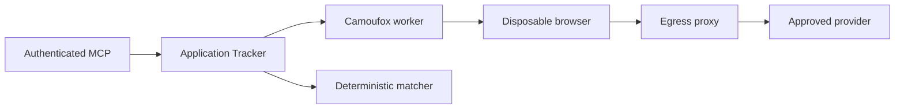

# Camoufox worker threat model

## Executive summary

The highest-risk boundary is attacker-influenced provider content executing in
an automated browser next to a sensitive application. The design reduces that
risk by keeping Camoufox outside the main container, removing direct worker
Internet routing, pinning all egress through a public-address-validating HTTPS
proxy, accepting only exact provider identities, and returning only bounded
structured JSON-LD. Browser or proxy escape and availability exhaustion remain
the principal residual risks.

## Scope and assumptions

- In scope: `src/application/job_posting_inspection.ts`,
  `src/application/job_posting_browser_fallback.ts`,
  `camoufox-worker/`, `deploy/compose.yml`, and the operator canary.
- Runtime production behavior is in scope. CI downloads and test fixtures are
  considered only where they protect the pinned supply chain.
- The public MCP endpoint remains authenticated and the fallback receives URLs
  only through `inspect_job_posting` or internal digest processing.
- Provider pages and DNS answers are attacker-controlled. Deployment
  environment and provider allowlists are operator-controlled.
- Camoufox is not trusted with SQLite, mailbox credentials, application
  secrets, host mounts, or a direct Internet route.
- The worker and egress proxy run as UID 65534 with every capability dropped
  under the default Docker AppArmor/seccomp profiles. The worker's bounded
  256-task cgroup limit leaves headroom above the measured 176-179 task
  Camoufox/Firefox startup peak.
- Out of scope: general browsing, CAPTCHA solving, mailbox retrieval, tracker
  mutation, prospect creation, and persistence of browser artifacts.

Open questions that would change risk: running the worker outside the supplied
Compose network topology, adding provider or egress suffixes, or mounting
persistent/browser-accessible host data.

## System model

### Primary components

- Application Tracker validates canonical posting identities and preserves the
  public structured contract
  (`src/application/job_posting_inspection.ts`,
  `src/application/job_posting_browser_fallback.ts`).
- The Camoufox worker validates its narrow authenticated request, launches one
  disposable browser, filters navigation/subresources, and extracts only
  bounded JSON-LD (`camoufox-worker/worker.py`).
- The egress proxy resolves DNS, rejects any non-public answer, pins one public
  address, and permits only allowlisted HTTPS/443 CONNECT tunnels
  (`camoufox-worker/egress_proxy.py`, `camoufox-worker/policy.py`).
- Compose supplies isolation and resource limits without changing the main
  container hardening (`deploy/compose.yml`).

### Data flows and trust boundaries

- MCP client → Application Tracker: canonical URL over authenticated MCP;
  schema validation, actor binding, tool audit, and existing request limits.
- Application Tracker → worker: provider plus exact canonical URL over a
  dedicated internal HTTP network; exact internal hostname and port, bearer
  token, 4 KiB request limit, strict JSON shape, no mailbox or tracker data.
  Compose explicitly passes only worker policy and resource variables rather
  than the application's `.env`.
- Worker → browser: exact URL and browser policy in one disposable process;
  timeout, request routing, no runtime add-on downloads, downloads/service
  workers/WebRTC/persistent storage disabled.
- Browser → egress proxy: CONNECT over a dedicated internal network; no direct
  worker network has an Internet gateway.
- Egress proxy → provider: TLS tunnel to one pinned, publicly resolved address
  on port 443; provider/subresource suffix allowlist.
- Worker → Application Tracker: protocol-versioned JSON containing one bounded
  posting or a stable unavailable reason; no HTML, cookies, screenshots, or
  page body.

#### Diagram

## Assets and security objectives

| Asset                                  | Why it matters                                              | Security objective (C/I/A) |
| -------------------------------------- | ----------------------------------------------------------- | -------------------------- |
| SQLite application ledger              | Contains job-search records and immutable history           | C/I/A                      |
| Outlook credentials and mailbox data   | Enables bounded read-only evidence workflows                | C/I                        |
| MCP actor authority and audit trail    | Prevents cross-user or unauthorized writes                  | I/A                        |
| Host and container runtime             | Browser compromise must not become host compromise          | C/I/A                      |
| Posting identity and structured result | Wrong identity could link evidence to the wrong application | I                          |
| Service capacity                       | Browser work is CPU, memory, PID, and network intensive     | A                          |
| Pinned worker artifacts                | Supply-chain drift can silently alter browser behavior      | I                          |

## Attacker model

### Capabilities

- Supply a recognized provider posting URL through an authenticated read-only
  tool or cause one to appear in a digest.
- Control provider HTML, scripts, redirects, subresource references, response
  timing, and some DNS answers.
- Trigger bounded concurrent requests within upstream MCP limits.
- Attempt malformed or oversized worker responses only after compromising the
  worker or its internal network.

### Non-capabilities

- Select an arbitrary scheme, port, host, provider, worker URL, or outbound
  suffix through MCP input.
- Access mailbox bodies, SQLite, app secrets, or host mounts from the supplied
  worker container.
- Request CAPTCHA interaction, screenshots, HTML, selectors, cookies, or
  storage through a public tool.
- Change runtime feature flags or Compose networks without operator authority.

## Entry points and attack surfaces

| Surface                 | How reached                            | Trust boundary          | Notes                                              | Evidence                                                          |
| ----------------------- | -------------------------------------- | ----------------------- | -------------------------------------------------- | ----------------------------------------------------------------- |
| `inspect_job_posting`   | Authenticated MCP                      | Client → app            | Existing exact URL schema and provider registry    | `src/server/mcp_server.ts`, `src/domain/job_postings.ts`          |
| Browser fallback client | Only after normal `provider_challenge` | App → worker            | Strict response and byte validation                | `src/application/job_posting_browser_fallback.ts`                 |
| Worker `/v1/inspect`    | Dedicated internal network             | App → worker            | Bearer token, 4 KiB body, strict keys              | `camoufox-worker/worker.py`                                       |
| Browser navigation      | Worker request                         | Worker → untrusted page | Exact identity, timeout, route filtering           | `camoufox-worker/worker.py`                                       |
| CONNECT proxy           | Worker-only network                    | Browser → proxy         | HTTPS/443, suffix and DNS policy                   | `camoufox-worker/egress_proxy.py`                                 |
| Canary CLI              | Operator shell                         | Operator → worker       | One to five exact canonical URLs, no database open | `src/server/job_posting_camoufox_canary.ts`                       |
| Image build             | CI/operator                            | Supply chain → runtime  | Version and digest pins                            | `camoufox-worker/Dockerfile`, `camoufox-worker/requirements.lock` |

## Top abuse paths

1. Attacker submits a provider-shaped internal URL → app canonicalization or
   proxy DNS policy rejects it → no internal connection.
2. Provider redirects to a different job or domain → browser route aborts the
   navigation → app returns `blocked`.
3. Provider page attempts third-party exfiltration → route and CONNECT suffix
   allowlists deny the subresource → privacy-safe denial count is logged.
4. Provider exploits Camoufox → compromised browser finds no direct Internet
   route, mounts, app secrets, or capabilities → residual impact is limited to
   its resource-bounded container and approved egress suffixes.
5. Caller floods challenged postings → app/provider pacing plus worker
   concurrency, CPU, memory, PID, timeout, and cooldown controls bound cost.
6. Worker returns a fabricated posting → app validates protocol, size, canonical
   URL, `JobPosting` type, posting identity, expiry, and field bounds → mismatch
   fails closed.
7. Provider reuses a posting ID for a different role → deterministic matching
   compares inspected employer/title with the existing application → conflict,
   no mutation.
8. Dependency tag moves → OCI digest, exact browser URL/SHA, and package pins
   prevent silent runtime substitution.

## Threat model table

| Threat ID | Threat source                    | Prerequisites                | Threat action                                              | Impact                                                      | Impacted assets                 | Existing controls (evidence)                                                                                                                                                                     | Gaps                                                      | Recommended mitigations                                                                                                 | Detection ideas                                               | Likelihood | Impact severity | Priority |
| --------- | -------------------------------- | ---------------------------- | ---------------------------------------------------------- | ----------------------------------------------------------- | ------------------------------- | ------------------------------------------------------------------------------------------------------------------------------------------------------------------------------------------------ | --------------------------------------------------------- | ----------------------------------------------------------------------------------------------------------------------- | ------------------------------------------------------------- | ---------- | --------------- | -------- |
| TM-001    | Malicious provider page          | Browser engine vulnerability | Escape browser and execute in worker                       | Container compromise, possible approved-domain egress abuse | Runtime, availability           | Separate UID-65534 container, default Docker AppArmor/seccomp, no direct Internet route, no mounts, read-only root, zero capabilities, bounded 256-task/memory/CPU limits (`deploy/compose.yml`) | Browser or kernel/container escape remains possible       | Patch through reviewed pin upgrades; keep host runtime current; review any future sandbox/profile changes independently | Worker crash/restart, resource spike, anomalous egress counts | low        | high            | high     |
| TM-002    | DNS/provider attacker            | Recognized posting host      | Resolve to private service or rebind after validation      | SSRF into private infrastructure                            | Host/network confidentiality    | Proxy rejects any non-global answer and connects to one pinned address (`egress_proxy.py`)                                                                                                       | Public provider IP can itself proxy traffic               | Keep egress suffix list minimal; consider host firewall egress policy                                                   | `blocked` and proxy denied counts                             | low        | high            | high     |
| TM-003    | Provider redirect/script         | Valid initial URL            | Escape to another host, port, scheme, or posting ID        | Data exfiltration or wrong identity                         | Posting integrity, network      | Browser route exact identity and HTTPS policy plus proxy port/suffix policy (`worker.py`, `policy.py`)                                                                                           | Approved suffix compromise                                | Review suffix expansion; fail canary on identity drift                                                                  | Blocked navigation events                                     | low        | high            | high     |
| TM-004    | Authenticated caller             | Tool access                  | Exhaust browser capacity                                   | Degraded inspection or app latency                          | Availability                    | App pacing/cooldown, worker admission and timeout, Compose limits (`job_posting_inspection.ts`, `worker.py`)                                                                                     | One provider can occupy the single slot                   | Alert and keep fallback optional; kill switch                                                                           | `resource_exhausted`, duration, health                        | medium     | medium          | medium   |
| TM-005    | Compromised worker/internal peer | Internal network access      | Forge oversized or mismatched response                     | Incorrect posting facts or app memory pressure              | Posting integrity, availability | Bearer token, streamed byte cap, strict schema/version/canonical URL/type/identity validation (`job_posting_browser_fallback.ts`)                                                                | Token is shared environment state                         | Rotate token after suspected internal compromise                                                                        | `worker_failure`, response validation failures                | low        | high            | high     |
| TM-006    | Provider                         | Reused posting ID            | Serve different employer/title for existing ID             | Wrong application match                                     | Ledger integrity                | Deterministic matcher returns conflict on strong-ID identity disagreement (`job_email_reconciliation.ts`)                                                                                        | Legitimate provider corrections may need review           | Require operator resolution outside inspector                                                                           | Conflict outcome rate                                         | medium     | high            | high     |
| TM-007    | Dependency publisher compromise  | New build or rebuild         | Substitute malicious package/browser                       | Worker compromise                                           | Supply chain, runtime           | Exact Python image digest, package pins, browser URL and SHA (`Dockerfile`, `requirements.lock`)                                                                                                 | Python wheels are version-pinned without per-wheel hashes | Add hash-locked wheels or internal artifact mirror                                                                      | CI artifact digest drift                                      | low        | high            | high     |
| TM-008    | Operator error                   | Production access            | Enable before canary or attempt an unsafe allowlist change | Increased SSRF/privacy/availability risk                    | All worker-bound assets         | Disabled default, exact internal endpoints, compiled maximum suffix set, documented canary/rollback (`.env.example`, `policy.py`, operations guide)                                              | Environment changes are outside code review               | Require change record and config diff review                                                                            | Startup config and deployment audit                           | medium     | medium          | medium   |

## Criticality calibration

- Critical: pre-auth app or host compromise, worker access to SQLite/mailbox
  secrets, or arbitrary private-network egress. None is accepted by design.
- High: browser/container escape, public-DNS-to-private SSRF, forged identity
  that could target the wrong application, or supply-chain compromise.
- Medium: bounded worker denial of service, provider-only availability loss, or
  operator misconfiguration caught before mutation.
- Low: privacy-safe metric noise or failed canaries with no workspace or mailbox
  state change.

## Focus paths for security review

| Path                                              | Why it matters                                            | Related Threat IDs     |
| ------------------------------------------------- | --------------------------------------------------------- | ---------------------- |
| `camoufox-worker/worker.py`                       | Browser lifecycle, request filtering, extraction, limits  | TM-001, TM-003, TM-004 |
| `camoufox-worker/egress_proxy.py`                 | DNS pinning and only outbound gateway                     | TM-001, TM-002, TM-003 |
| `camoufox-worker/policy.py`                       | Canonical provider and public-address policy              | TM-002, TM-003         |
| `camoufox-worker/Dockerfile`                      | Browser and Python supply chain                           | TM-001, TM-007         |
| `deploy/compose.yml`                              | Trust boundaries and resource isolation                   | TM-001, TM-002, TM-004 |
| `src/application/job_posting_browser_fallback.ts` | Internal authentication and untrusted response validation | TM-004, TM-005         |
| `src/application/job_posting_inspection.ts`       | Fallback invocation and public contract mapping           | TM-003, TM-005         |
| `src/application/job_email_reconciliation.ts`     | Posting reuse and identity conflict logic                 | TM-006                 |
| `src/server/config.ts`                            | Disabled default and allowlist/token requirements         | TM-008                 |
| `src/server/job_posting_camoufox_canary.ts`       | Operator-only live validation boundary                    | TM-008                 |

## Quality check

- Covered the MCP, internal worker, browser, proxy, canary, and build entry
  points.
- Represented every runtime trust boundary in at least one threat.
- Kept runtime behavior separate from CI/build supply-chain concerns.
- Used the supplied production, exposure, privacy, and non-mutation context.
- Marked topology or allowlist changes as assumptions requiring a new review.
